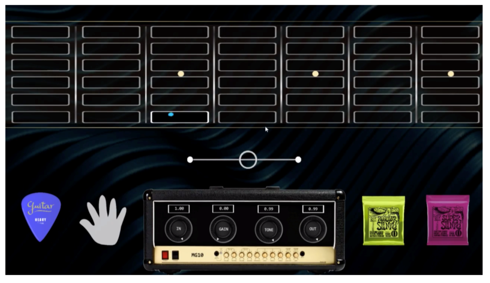

# Eye Driven Guitar

[Click here to watch the demo of the eye-driven guitar](https://www.youtube.com/watch?v=XFOOWVDlkvQ "Click here to watch the demo")

This is the public github page for demoing the "Eye Driven Guitar" in the multi sensory experience lab at Aalborg University in Copenhagen. The "Eye Driven Guitar" guitar was made to allow people with motion dissabilities to explore sound, in this case through playing and manipulating a guitar and a Marshal MG10 amplifier using eye-tracking. All sounds have been made using physical modelling (for the guitar) and virtual analog simulations (for the amplifier).

## Setup
To set up the program, please follow these steps:
- Connect the tobii eye-tracker (tobii 5) and calibrate (the tobii experience app should launch when connected)
- Use station 10 or 1 in the lab, these are optimized and updated for this use-case.
- Make sure that the resolution of the screen is set to "1920 x 1080" (display settings -> display resolution).
- Download the "Executable" folder and launch the "2DScene.exe" file.
- Make sure that the eyes are tracking (sometimes it has to be restarted if the gaze plot is not invoked at start-up).
